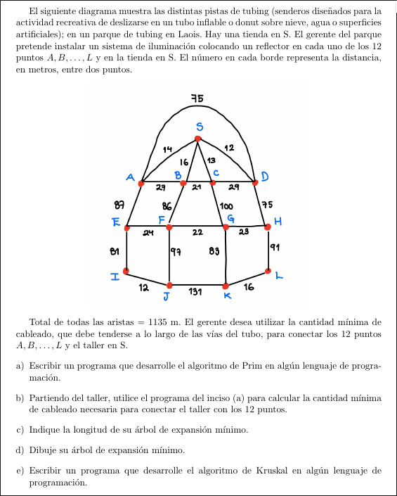
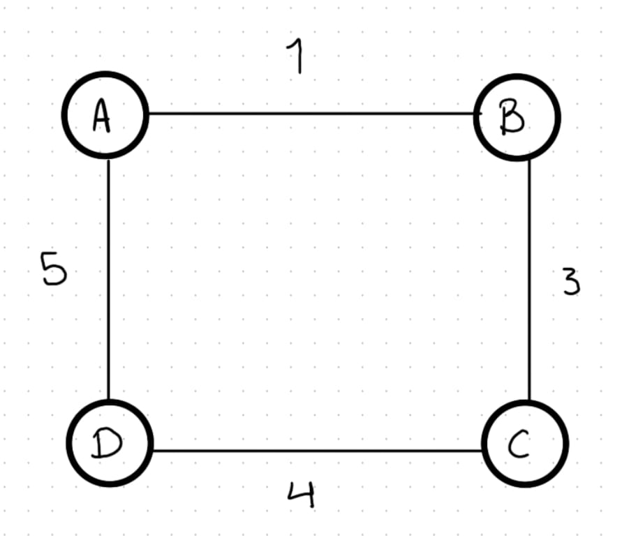
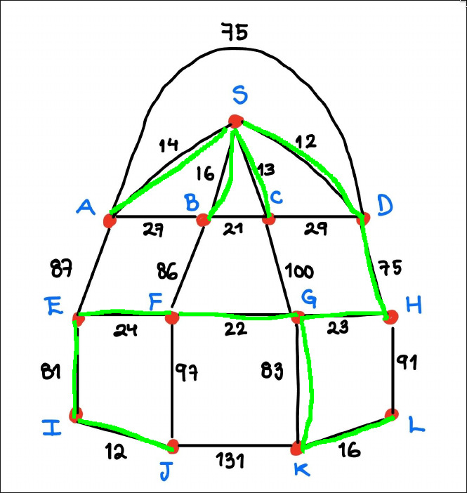
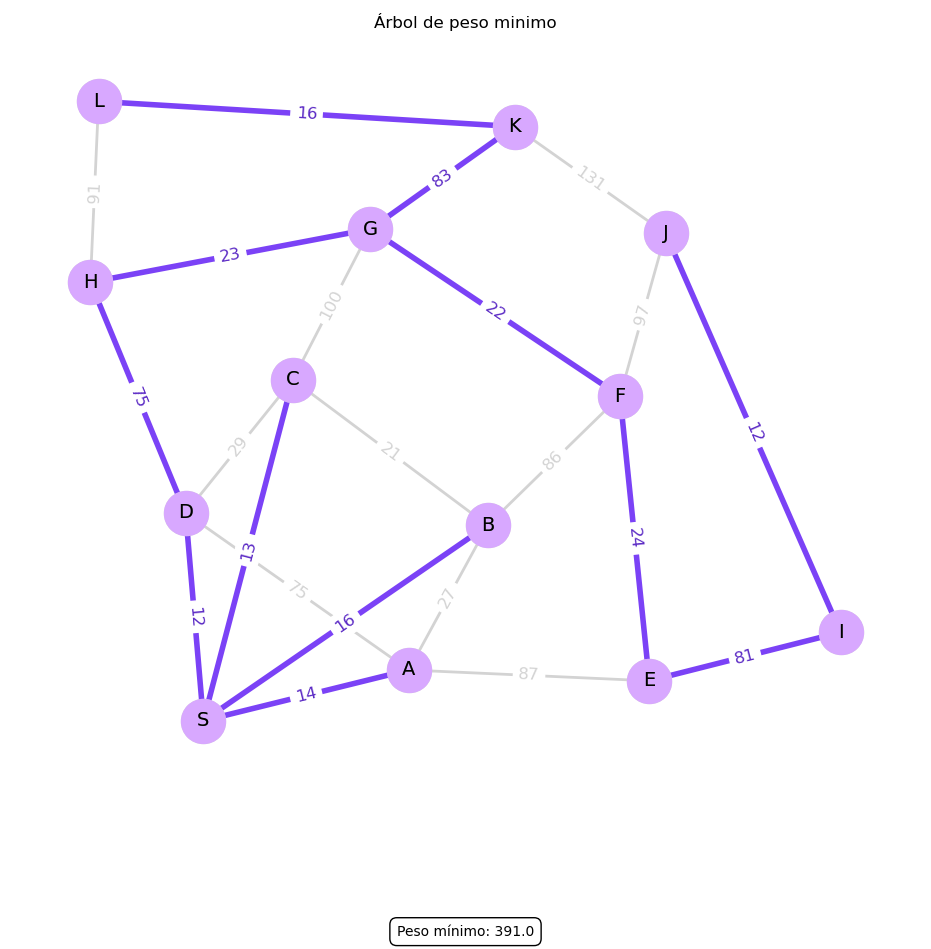

# Proyecto Aplicacion Teoria de Grafos
**Reyes Garcia Joel**


# Importante

Para el correcto funcionamiento de los algoritmos de Prim y Kruskal, es **esencial** que el archivo `grafos_tools.py` esté ubicado en el mismo directorio que los archivos que implementan los algoritmos de Prim y Kruskal al momento de ejecutar el programa.

# Librerías Necesarias

Además, es necesario contar con las siguientes librerías de Python instaladas:

* `networkx`
* `numpy`
* `matplotlib.pyplot`


# Problema:



# Manejo y Representación del Grafo

El programa está diseñado para leer las aristas del grafo a partir de una lista de Python llamada `Aristas`. Cada elemento de esta lista representa una arista y debe tener un formato específico, por ejemplo: `'A100B'`.

En este formato:
* `'A'` y `'B'` son los vértices (nodos) que conecta la arista.
* `'100'` es el peso o costo asociado a esa arista.

Dado que trabajamos con grafos no dirigidos, es importante recordar que `'A100B'` y `'B100A'` representan la misma arista. Por favor, ten precaución de no duplicar las aristas en tu lista `Aristas`.

### Ejemplo:

Para el grafo que se muestra a continuación:



La lista de aristas correspondiente se guardaría de esta manera:

```python
aristas = ["A1B", "A3C", "C4D", "D5A"]
```

# `grafos_tools.py`

Este módulo contiene funciones importantes para trabajar con grafos. Sirve para leer, preparar y organizar la información del grafo antes de usar algoritmos como Kruskal o Prim.

A continuación se explican las funciones más importantes:

---

## `lista_vertices(aristas_n)`

```python
def lista_vertices(aristas_n):
    vertices = set()
    for arista in aristas_n:
        vertice_1, vertice_2 = extraer_vertices(arista)
        vertices.add(vertice_1)
        vertices.add(vertice_2)

    vertices = list(vertices)
    indice = {v: i for i, v in enumerate(vertices)}
    return vertices, indice
````

**Funcion**

Esta función encuentra todos los vértices únicos del grafo a partir de la lista de aristas. Además, crea un diccionario que le asigna un número (índice) a cada vértice. Esto es útil para representar el grafo como matriz y para algoritmos como el de Kruskal.

---

## `ordenar_aristas(aristas_n)`

```python
def ordenar_aristas(aristas_n):
    lista_ordenada = sorted(aristas_n, key=lambda x: extraer_peso(x))
    return lista_ordenada
```

**Funcion**

Ordena las aristas de menor a mayor peso. Esto es necesario para que el algoritmo de Kruskal funcione correctamente.

---

## `matriz_adyacencia(aristas, vertices, indice)`

```python
import numpy as np

def matriz_adyacencia(aristas, vertices, indice):
    n = len(vertices)
    matrix = np.full((n, n), float("inf"))  # Matriz n x n llena de infinitos

    for i in range(n):
        matrix[i, i] = 0  # La diagonal representa conexiones consigo mismo

    for arista in aristas:
        v1, v2 = extraer_vertices(arista)
        peso = extraer_peso(arista)
        matrix[indice[v1], indice[v2]] = peso
        matrix[indice[v2], indice[v1]] = peso  # Grafo no dirigido

    return matrix
```

**Funcion**

Crea la **matriz de adyacencia** del grafo.

* Si hay una conexión entre dos vértices, se guarda el peso.
* Si no hay conexión, se pone `inf` (infinito).
* En la diagonal se pone `0`, ya que es el mismo vértice.

Esta matriz se usa en algoritmos como el de Prim para saber qué vértices están conectados y con qué peso.

## `dibujar_grafo(vertices, aristas):`

```python
def dibujar_grafo(vertices, aristas):
    G = nx.Graph()
    for vertice in vertices:
        G.add_node(vertice)

    for arista in aristas:
        u, v = extraer_vertices(arista)
        peso = extraer_peso(arista)
        G.add_edge(u, v, weight=peso)
    return G
```
**Funcion**

Crea un grafo a partir de los vertices y las aristas dadas.

# Redultado esperado

Se espera que el algoritmo sea capaz de obtener el sguiente arbnol de peso minimo, con un peso minimo total de 391mts



# Algoritmo de Prim

```python
def prim(matriz, vertices):
    n = len(matriz)
    path = [False] * n
    path[0] = True
    arbol_minimo = []
    peso_min = 0
    while len(arbol_minimo) < n - 1:
        v1 = -1
        v2 = -1
        menor_peso = float("inf")
        for i in range(n):
            if path[i]:
                for j in range(n):
                    if not path[j] and matriz[i][j] < menor_peso:
                        menor_peso = matriz[i][j]
                        v1 = i
                        v2 = j

        path[v2] = True
        arbol_minimo.append(f"{vertices[v1]}{int(menor_peso)}{vertices[v2]}")
        peso_min += menor_peso

    return arbol_minimo, peso_min
``` 
**Funcion**

Se inicia con un path (una lista de valores booleanos) que, usando el índice de cada vértice, indica si este ya fue incluido en el árbol. Luego, el algoritmo busca repetidamente la arista de menor peso que conecta un vértice ya incluido en el árbol con uno que aún no lo está, revisando los valores de la matriz de adyacencia. Este proceso se repite n-1 veces 
(siendo n el número de vértices), pues es la cantidad exacta de aristas que un Árbol siempre contiene.
Finalmente, se calcula y se devuelve al usuario el peso total de las aristas que forman el Arbol Generador Minimo, junto con la lista de dichas aristas

## Resultados

Al usar el codigo creado en `prim.py` se obtiene el siguente grafo:


El cual coincide con el resultado esperado.


# Algoritmo de Kruskal

```python
def kruskall(aristas):
    aristas_kruskall = []
    conjuntos = []
    peso_min = 0
    for arista in aristas:
        u, v = gt.extraer_vertices(arista)

        conjunto_u = None
        conjunto_v = None
        for c in conjuntos:
            if u in c:
                conjunto_u = c
            if v in c:
                conjunto_v = c

        if conjunto_u is None and conjunto_v is None:
            conjuntos.append({u, v})
            aristas_kruskall.append(arista)

        elif conjunto_u is not None and conjunto_v is None:
            conjunto_u.add(v)
            aristas_kruskall.append(arista)

        elif conjunto_u is None and conjunto_v is not None:
            conjunto_v.add(u)
            aristas_kruskall.append(arista)

        elif conjunto_u != conjunto_v:
            conjunto_u.update(conjunto_v)
            conjuntos.remove(conjunto_v)
            aristas_kruskall.append(arista)

        else:
            pass
    for arista in aristas_kruskall:
        peso_min += gt.extraer_peso(arista)

    return aristas_kruskall, peso_min
```
Mediante la función `ordenar_aristas` se ordenan las aristas de menor a mayor por su peso, posteriormente si una arista conecta dos vértices que aún no están en el mismo grupo, 
se añade al Arbol Generador y sus grupos se unen. Si los vértices ya están en el mismo grupo, la arista se descarta para evitar ciclos. Finalmente, la función devuelve las aristas del arbol y su peso total.

## Resultados:
Al usar este programa se obtiene:

El cual conicide con los resultados esperados
